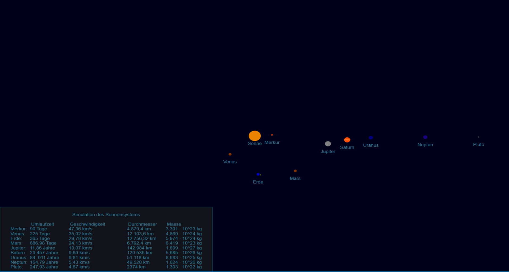

# Sonnensystem-Simulator-Direct2D

Kleines Projekt mit Direct2D. 

Es werden die Umlaufbahnen der Planeten unseres Sonnensystem mit Trigonometrie simuliert.
Hier ein passender Link dazu: https://en.wikipedia.org/wiki/Orbital_mechanics

Erstellt wurde diese Projekt mit Visual Studio 2015. Ich habe es nur unter Windows 10 getestet. Benötigt wird zum kompilieren das WinSDK. Es muss die verwendete Version anschließend im Projekt eingestellt werden.

 
